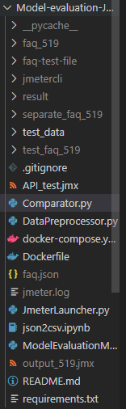

# FAQ 모델 테스트하기

## 프로그램 요구사항

“1. 준비물”처럼 이쁜 csv파일이 필요하고 데이터는 500개 이상이어야 합니다.

requirements.txt를 import해야 한다.

csv 파일은 git repository 내에 json2csv.ipynb 로 만들 수 있습니다.

# 순서

1. faq2.5_hong.csv를 faq-test-file 폴더에 넣어준다.
2. python ModelEvaluationManager.py
3. result 폴더에 결과물 확인.
4. 한번 더 실행하고 싶으면 gitignore에 있는 폴더 및 파일들을 지워야 한다.

예시)



faq_519, result, separate_faq_519, test_faq_519, output_519.jmx 를 지워주어야 합니다.

## 1. 준비물

이런 식으로 잘 정리된 csv 파일이 필요하다.


question과 answer로 한쌍 씩 묶음.

## 2. 일단 jmeter 테스트

### 리눅스 환경에 jmeter 설치

jmeter 다운

`wget [https://dlcdn.apache.org//jmeter/binaries/apache-jmeter-5.5.tgz](https://dlcdn.apache.org//jmeter/binaries/apache-jmeter-5.5.tgz)`

압축해제

`tar -xvzf apache-jmeter-5.5.tgz`

[jmeter.properties](http://jmeter.properties) 수정


[system.properties](http://system.properties) 수정


미리 GUI 환경에서 테스트하고 만들어둔 jmx파일의 일부

```xml
<?xml version="1.0" encoding="UTF-8"?>
<jmeterTestPlan version="1.2" properties="5.0" jmeter="5.5">
  <hashTree>
    <TestPlan guiclass="TestPlanGui" testclass="TestPlan" testname="Test Plan" enabled="true">
      <stringProp name="TestPlan.comments"></stringProp>
      <boolProp name="TestPlan.functional_mode">false</boolProp>
      <boolProp name="TestPlan.tearDown_on_shutdown">true</boolProp>
      <boolProp name="TestPlan.serialize_threadgroups">false</boolProp>
      <elementProp name="TestPlan.user_defined_variables" elementType="Arguments" guiclass="ArgumentsPanel" testclass="Arguments" testname="User Defined Variables" enabled="true">
        <collectionProp name="Arguments.arguments"/>
      </elementProp>
      <stringProp name="TestPlan.user_define_classpath"></stringProp>
    </TestPlan>
    <hashTree>
      <ThreadGroup guiclass="ThreadGroupGui" testclass="ThreadGroup" testname="Thread Group" enabled="true">
        <stringProp name="ThreadGroup.on_sample_error">continue</stringProp>
        <elementProp name="ThreadGroup.main_controller" elementType="LoopController" guiclass="LoopControlPanel" testclass="LoopController" testname="Loop Controller" enabled="true">
          <boolProp name="LoopController.continue_forever">false</boolProp>
          <stringProp name="LoopController.loops">1</stringProp>
        </elementProp>
        <stringProp name="ThreadGroup.num_threads">660</stringProp>
        <stringProp name="ThreadGroup.ramp_time">1</stringProp>
        <boolProp name="ThreadGroup.scheduler">false</boolProp>

...
```

### 명령어

apache-jmeter-5.5/bin 에서 실행시키면 된다.

`./jmeter -n  -t ../../faq_100/API_test_100.jmx -l ../../faq_100/test_faq_100.log`

## 이슈


jmter는 여러 스레드로 api를 쏘는데 recipient id대로 순서대로 안나올 수도 있다. json 배열로 만들기 위해 데이터 후처리를 진행하였다.

## User Defined Variables


User Defined Variables을 넣어서 api 개수를 읽어서 자동으로 이거만 바꾸면 된다.

jmx의 모든 영역에서 ${amount_of_json} 만 넣으면 인식하더라.

`./jmetercli/apache-jmeter-5.5/bin/jmeter -n -t ./API_test.jmx -l ./test_faq_100/test_100.log`